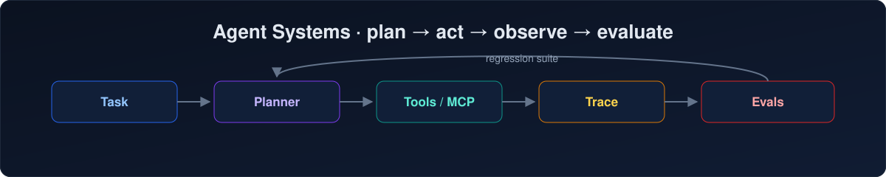

  

## Ursasi

Engineer focused on **LLM agents** — tool use, orchestration, evals, and making agents reliable enough to trust.

[Personal website](https://ursasi.github.io/)

I build agent systems end to end: planning and tool-calling loops, context and memory management, MCP integrations, and the evaluation / observability infrastructure that keeps them honest in production.

I spend much of my time tracing agent failures, building eval harnesses, and turning what breaks in production into reproducible test cases.

### Current work

*   **Agent runtime:** planning / tool-calling loops, context window management, and agent memory.
*   **Tool use & MCP:** tool integrations, sandboxed execution, and protocol-level plumbing.
*   **Evals:** regression suites for prompts and tool behavior, trace-driven debugging.
*   **Observability:** agent tracing, failure taxonomies, and diagnostics for multi-step runs.

### Projects

<!-- 把下面的换成你真实的仓库，哪怕很小 -->
*   [project-one](https://github.com/Ursasi/project-one): one-line description of what it does and who it's for.
*   [project-two](https://github.com/Ursasi/project-two): one-line description.

### Toolbox

**Agent & LLM**

**Languages**

**Infrastructure**

### Contact

[zshprint@163.com](mailto:zshprint@163.com)
